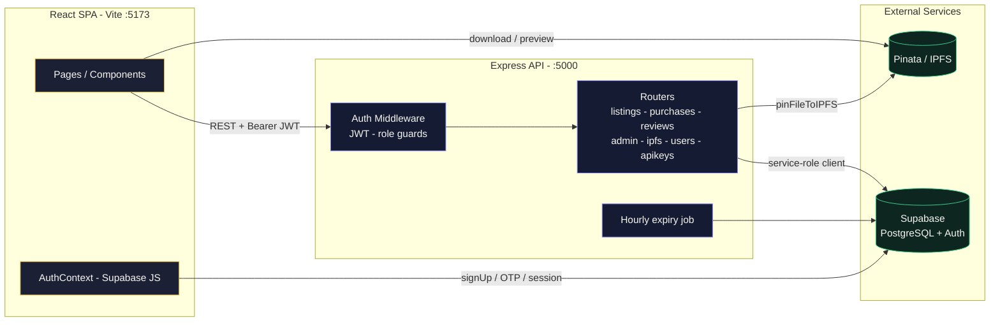

<div align="center">


<br>


<br><br>


<br>


<br>


</div>

---

## 📑 Table of Contents

- [Overview](#-overview)
- [Key Features](#-key-features)
- [Tech Stack](#-tech-stack)
- [Architecture](#-architecture)
- [Project Structure](#-project-structure)
- [Getting Started](#-getting-started)
- [Environment Variables](#-environment-variables)
- [Database Schema](#-database-schema)
- [API Reference](#-api-reference)
- [Utility Scripts](#-utility-scripts)
- [Development Phases](#-development-phases)
- [Roadmap & Known Limitations](#-roadmap--known-limitations)


## 🌟 Overview

MetaModels is a full-stack marketplace where:

- **Sellers** upload AI models / agents (model cards, weights, docs) to **IPFS via Pinata**, set rent & buy pricing, and publish listings after **admin approval**.
- **Buyers** browse the marketplace, rent or purchase assets through a **checkout flow**, and instantly receive a **one-time API key** for the asset.
- **Admins** moderate the catalog — approving or rejecting pending listings and monitoring platform revenue.

Authentication is handled by **Supabase Auth** (email + OTP verification), the API is a stateless **Express** service using the Supabase service-role client, and the UI is a **React 19** single-page app with a dark "Obsidian Gold" design language.

> [!NOTE]
> 💳 **Test mode:** payments are mocked — no real charges are made. See [Roadmap](#-roadmap--known-limitations).




## ✨ Key Features

<table>
  <tr>
    <td width="33%">

### 👤 Buyers
- 🔍 Search + category & type filters
- 🖼️ Detail pages: tabs, gallery, reviews
- ⏱️ Rent 1–30 days with live pricing
- 🔑 One-time **secret API key** reveal
- ⏳ Rental countdown + IPFS downloads
- ⭐ Rate & review purchased assets

</td>
    <td width="33%">

### 🛍️ Sellers
- 📦 List models / agents with capability tags
- ☁️ Direct **IPFS uploads** via Pinata
- 📈 Revenue chart, rentals & transactions
- 🎛️ Edit / pause / delete listings
- ♻️ Re-rent purchased assets as reseller

</td>
    <td width="33%">

### 🛡️ Admins
- 📊 Platform KPIs (revenue, listings, users)
- 📋 Moderation queue with detail modal
- ✅ Approve / reject listings in one click
- 🚪 Hidden admin portal on landing page

</td>
  </tr>
  <tr>
    <td colspan="3">

### ⚙️ Platform
`email + OTP verification` · `role-based access (buyer / seller / both / admin)` · `JWT-protected API with ownership checks` · `SHA-256 hashed keys` · `hourly expiry jobs` · `30-min idle auto-logout` · `animated routes & toasts`

</td>
  </tr>
</table>


## 🧰 Tech Stack

| Layer | Technology |
|---|---|
| 🎨 Frontend | React 19, Vite 8, React Router 7, Tailwind CSS 4, Framer Motion, Recharts |
| ⚙️ Backend | Node.js, Express 5 (CommonJS), Multer (uploads) |
| 🗄️ Database & Auth | Supabase (PostgreSQL + RLS + GoTrue auth) via `@supabase/supabase-js` |
| ☁️ Storage | IPFS pinning through **Pinata** API, served via Pinata gateway |
| 💳 Payments | Mock checkout (test mode) — pluggable for Stripe/Razorpay later |
| 🛠️ Tooling | ESLint, npm, concurrent dev servers |


## 🏗️ Architecture



**Request flow:** browser authenticates directly with Supabase → receives a JWT → every API call sends `Authorization: Bearer <token>` → middleware resolves the user + profile → routers perform ownership/role checks → responses are JSON.


## 📁 Project Structure

```
metamodels/
├── assets/                   # README visuals (animated SVGs)
├── client/                   # React SPA
│   ├── src/
│   │   ├── pages/            # 12 screens (Landing, Marketplace, Checkout, …)
│   │   ├── components/
│   │   │   ├── auth/         # ProtectedRoute
│   │   │   ├── layout/       # Navbar, Footer, ErrorBoundary, ScrollToTop
│   │   │   └── ui/           # Button, Input, Card, Badge, Avatar, Modal, Spinner
│   │   ├── context/          # AuthContext (session + profile + idle logout)
│   │   ├── lib/              # supabaseClient
│   │   └── assets/
│   └── vite.config.js / tailwind.config.js
│
├── server/                   # Express API
│   ├── server.js             # App entry, CORS, routers, expiry job
│   ├── routes/               # listings, purchases, reviews, admin, ipfs, users, apikeys, auth
│   ├── middleware/           # requireAuth / requireSeller / requireBuyer / requireAdmin
│   ├── lib/                  # supabaseAdmin (service-role client)
│   └── *.js                  # DB utility & migration scripts
│
├── schema.sql                # Full Supabase DDL + RLS policies
├── setup_admin.sql           # Promote an account to admin
├── SUPABASE_EMAIL_TEMPLATE.md# Branded OTP email template
├── design-system/            # Generated UI/UX design specs (reference)
└── .agent/                   # UI/UX skill datasets used to generate specs
```


## 🚀 Getting Started

> [!TIP]
> Fastest path: clone → run the two SQL files in Supabase → fill `.env` → start both dev servers.

### Prerequisites
- **Node.js** ≥ 18 (npm ≥ 9)
- A free **[Supabase](https://supabase.com)** project
- A free **[Pinata](https://app.pinata.cloud)** account (IPFS pinning)

### 1. Clone the repository

```bash
git clone https://github.com/AbdullahShahid156/metamodels.git
cd metamodels
```

### 2. Set up Supabase

1. Create a new Supabase project.
2. Open **SQL Editor** and run, in order:
   - [`schema.sql`](./schema.sql) — tables, triggers, RLS policies
   - [`setup_admin.sql`](./setup_admin.sql) — adds `is_admin` and promotes your admin email
3. Copy your project credentials from **Project Settings → API**.
4. (Optional) Install the branded OTP email using [`SUPABASE_EMAIL_TEMPLATE.md`](./SUPABASE_EMAIL_TEMPLATE.md)
   — enable **“Use OTP instead of link”** under Auth → Email Templates.

### 3. Configure environment variables

```bash
cp server/.env.example server/.env
cp client/.env.example client/.env
```

Fill both files with your Supabase + Pinata credentials ([details below](#-environment-variables)).

### 4. Install dependencies

```bash
npm install --prefix server
npm install --prefix client
```

### 5. (Optional) Seed demo data

```bash
node server/seed_db.js     # 4 sample listings
node server/verify_db.js   # schema smoke test
```

### 6. Run in development mode

Open **two terminals**:

```bash
# Terminal 1 — API (http://localhost:5000)
node server/server.js

# Terminal 2 — Web app (http://localhost:5173)
npm run dev --prefix client
```

### 7. Production build

```bash
npm run build --prefix client   # outputs client/dist/
```


## 🔐 Environment Variables

> [!WARNING]
> `.env` files are **git-ignored** — never commit real keys. Only the `.env.example` templates live in the repo.

### `server/.env`

| Variable | Description |
|---|---|
| `PORT` | API port (default `5000`) |
| `SUPABASE_URL` | Supabase project URL |
| `SUPABASE_ANON_KEY` | Public anon key |
| `SUPABASE_SERVICE_ROLE_KEY` | **Server-only** key that bypasses RLS — never expose |
| `CLIENT_URL` | CORS origin (default `http://localhost:5173`) |
| `PINATA_API_KEY` | Pinata API key for IPFS pinning |
| `PINATA_SECRET_KEY` | Pinata secret key |

### `client/.env`

| Variable | Description |
|---|---|
| `VITE_SUPABASE_URL` | Supabase project URL |
| `VITE_SUPABASE_ANON_KEY` | Browser-safe anon key |
| `VITE_API_URL` | API base (default `http://localhost:5000/api`) |


## 🗄️ Database Schema

| Table | Purpose | Key columns |
|---|---|---|
| `profiles` | User accounts | `id` → `auth.users`, `display_name`, `role` (`buyer/seller/both`), `is_admin`, `bio`, `avatar_url` |
| `listings` | Marketplace assets | `seller_id`, `name`, `slug`, `category`, `type` (`model/agent`), `capabilities[]`, `rent_price`, `buy_price`, `status` (`pending/active/paused/rejected`), `showcase_images[]`, `model_card_url`, `rating`, `total_sales` |
| `purchases` | Buyer transactions | `buyer_id`, `listing_id`, `type` (`rent/buy`), `price_paid`, `expires_at`, `api_key` *(SHA-256 hash)*, `key_preview`, `is_active` |
| `api_keys` | Seller-issued keys | `seller_id`, `listing_id`, `key_hash`, `expiry_date`, `usage_limit`, `is_active` |
| `reviews` | Asset reviews | `buyer_id`, `listing_id`, `purchase_id`, `rating` (1–5), `body` |

Row-Level Security is **enabled on all tables**; the API writes through the service-role client after enforcing auth, roles and ownership in code.


## 📡 API Reference

Base URL: `http://localhost:5000/api` — all protected routes require `Authorization: Bearer <supabase-jwt>`.

### Listings
| Method | Endpoint | Access | Description |
|---|---|---|---|
| GET | `/listings` | Public | Active listings (`category`, `type`, `search` filters) |
| GET | `/listings/mine` | Seller | Current seller's listings |
| GET | `/listings/:slug` | Public | Listing detail with seller profile |
| POST | `/listings` | Seller | Create listing (→ `pending` approval) |
| PATCH | `/listings/:id` | Owner | Update listing / toggle status |
| DELETE | `/listings/:id` | Owner | Delete listing + cascade |

### Purchases & Checkout
| Method | Endpoint | Access | Description |
|---|---|---|---|
| POST | `/purchases` | Buyer | Mock checkout → returns `rawApiKey` **once** |
| GET | `/purchases/mine` | Buyer | Purchase history with listings + own review |
| GET | `/purchases/seller-stats` | Seller | Revenue, rentals, 30-day chart data |

### Reviews
| Method | Endpoint | Access | Description |
|---|---|---|---|
| POST | `/reviews` | Buyer | Review a purchased listing (recomputes avg rating) |
| GET | `/reviews/:listing_id` | Public | Reviews for a listing |

### Admin
| Method | Endpoint | Access | Description |
|---|---|---|---|
| GET | `/admin/stats` | Admin | Platform KPIs |
| GET | `/admin/pending-listings` | Admin | Moderation queue |
| PATCH | `/admin/listings/:id/approve` | Admin | Approve listing |
| PATCH | `/admin/listings/:id/reject` | Admin | Reject listing |

### IPFS / Users / Keys / Auth
| Method | Endpoint | Access | Description |
|---|---|---|---|
| POST | `/ipfs/upload` | Seller | Pin file to IPFS (100 MB limit) → `IpfsHash` |
| GET/PUT | `/users/profile` | Auth | Read / update profile |
| POST | `/users/upgrade-seller` | Auth | Upgrade `buyer → seller` |
| GET/POST/DELETE | `/apikeys/*` | Seller | List / generate / revoke seller keys |
| POST | `/auth/register` · `/auth/resend-otp` · `/auth/verify-otp` | Public | Server-side OTP helpers (alt. to client SDK) |
| GET | `/health` | Public | Liveness check |


## 🛠️ Utility Scripts

Run from the `server/` directory (`node <script>.js`):

| Script | Purpose |
|---|---|
| `seed_db.js` | Insert 4 sample listings (idempotent) |
| `verify_db.js` | Smoke-test every table (✅/❌ report) |
| `test_purchase.js` | Manual purchase-row insert test |
| `check_schema.js` | Inspect live `listings` columns |
| `clear_all_listings.js` | ⚠️ Wipe reviews → keys → purchases → listings |
| `add_column.js` · `add_showcase_images.js` · `add_key_preview.js` | One-off column migrations |

> [!IMPORTANT]
> `clear_all_listings.js` is **destructive** — it deletes marketplace data. Run only on dev/demo databases.


## 📆 Development Phases

The repository is delivered in reviewable, single-responsibility commits:

| Phase | Commit scope |
|---|---|
| 1️⃣ | Repository scaffolding — `.gitignore`, env templates, README |
| 2️⃣ | Database foundation — `schema.sql`, admin bootstrap, OTP email template |
| 3️⃣ | Express API — middleware + all routers (listings, purchases, reviews, admin, IPFS) |
| 4️⃣ | React frontend — full SPA (auth, marketplace, checkout, seller & admin dashboards) |
| 5️⃣ | DB utility & migration scripts |
| 6️⃣ | Design system specs & UI/UX agent assets |
| 7️⃣ | README visual identity — animated banner, typing tagline, status bars, dividers |


## 🗺️ Roadmap & Known Limitations

Honest status of the current build:

- [x] Auth (OTP), roles, admin moderation, reviews, seller/admin dashboards
- [x] IPFS uploads (Pinata) + gateway downloads
- [x] Mock checkout with one-time API-key reveal
- [ ] **API-key redemption/invocation endpoint** — keys are issued but not yet validated against `api_endpoint`
- [ ] **API Key Manager UI** (`/seller/keys` is a placeholder — backend routes exist)
- [ ] Real payment provider (Stripe / etc.)
- [ ] Profile editing UI (API exists, UI is read-only)
- [ ] Pagination + price-range filtering on marketplace
- [ ] Automated tests & CI
- [ ] Revealable key history in *My Purchases* (currently only the SHA-256 hash is stored)


## 📄 License

MIT — feel free to use, fork, and build upon this project.

<div align="center">

<br>


<sub>Built as a Final Year Project · MetaModels © 2026</sub>

</div>
